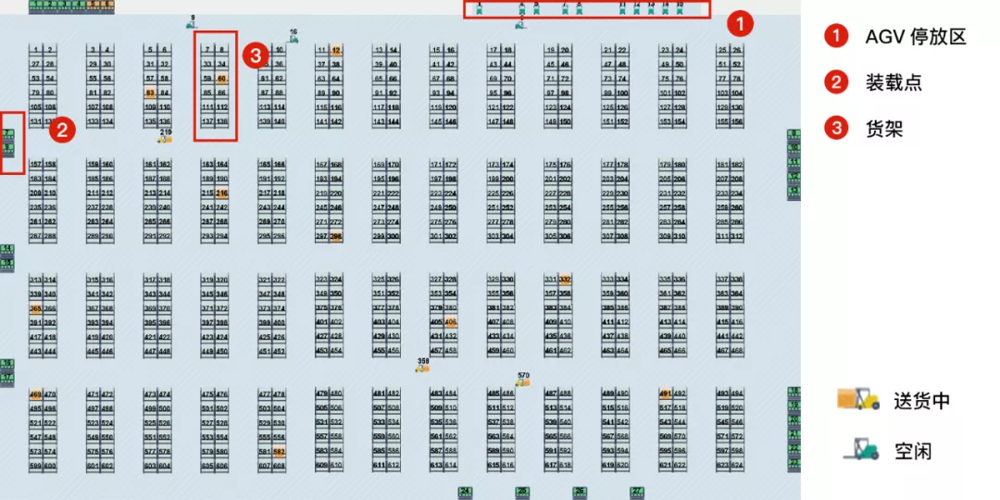
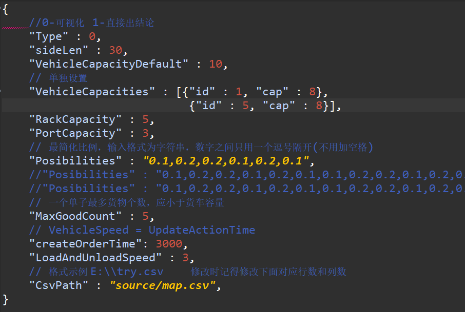
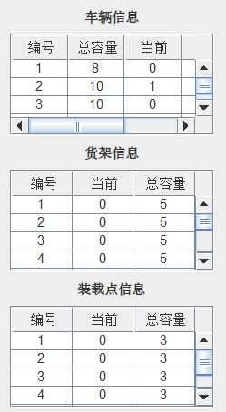
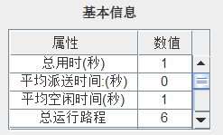
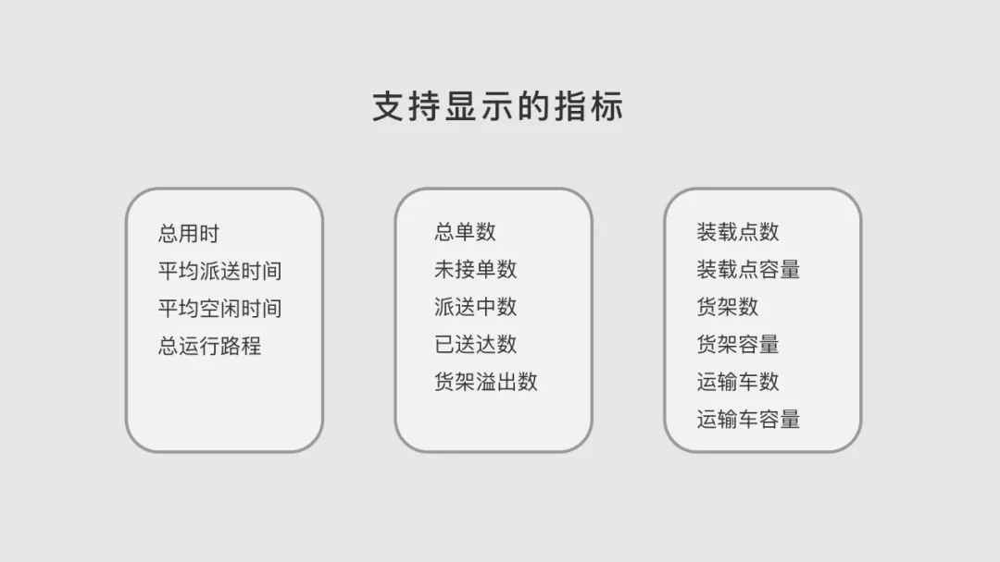
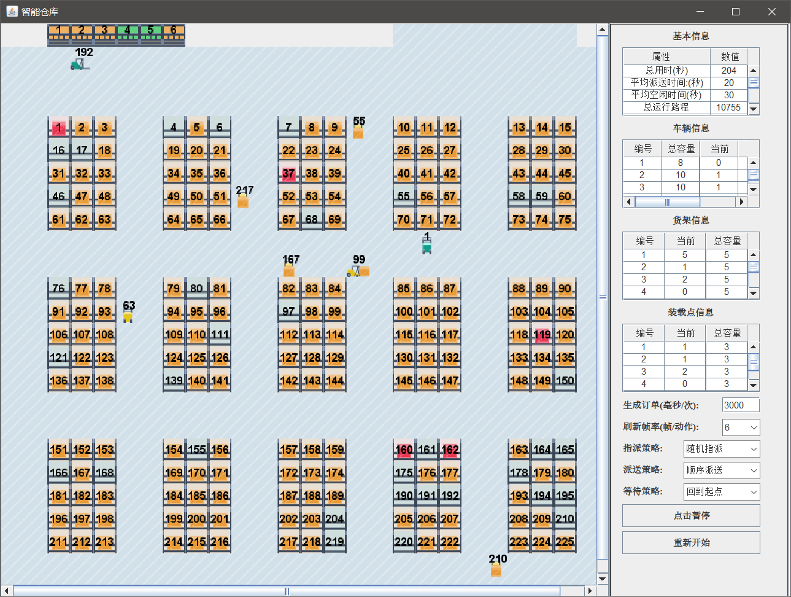
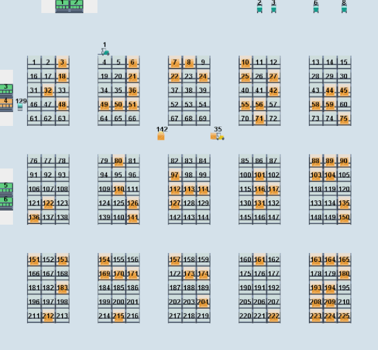

## 智能仓库仿真系统

### 前言
随着我国社会主义市场经济的不断发展，以及互联网技术的普及，我国电子商务等产业迎来了新的发展高峰。为减少订单履行成本，满足客户多样化需求，增强核心竞争力，主流电商企业纷纷加大对仓储物流的投资力度，这为仓储业的发展带来了广阔的发展空间。
与此同时，业务需求则呈现出复杂化的趋势，加之行业竞争愈演愈烈，人力仓储业的不足显得愈发突出。针对此问题开发这款智能仓储AGV调度优化仿真平台，其可以对输入的仓库布局、AGV 数量与速度，结合实际生产的订单产生情况及调度策略，进行仓储管理系统运行过程的可视化仿真模拟，实时追踪 AGV 与货架的状况，并自动计算出该系统的运行效率指标。

### 实现功能

1. 自定义仓库布局(修改source对应调用的csv文件，即可产生相应的地图)

其中csv文件中有对应关系：(0-无、 1-车、 2-货架、 3-装载点、 4-路)

2. 变量调整

可以修改`source\warehouse.json`进行下列信息进行调整：
+ 是否可视化
+ 可视化单位边长
+ 运输车默认容量（运输车容量可单独设置）
+ 货架容量
+ 装载点容量
+ 每个装载点出现订单的概率
+ 一个订单最多货物个数
+ 随机产生订单的时间间隔
+ 装卸货所需单位时间
+ 当前地图对应csv的路径

3. 可视化

状态对应为（绿色\无-空、黄色-有、红色-满），货架举例如下：

此外，在数据界面我们还提供了更详细的对象信息：

|  运输车   | 货架  | 装载点 |
|  ----  | ----  | ---- |
| 编号  | 编号 | 编号 |
| 总容量  | 当前容量 | 当前容量 |
| 当前容量  | 总容量 | 总容量 |
| 目标货架编号  | | |

展示如下：

4. 效率量化追踪

在数据面板，平台提供有派送路线总长度、每笔订单平均派送时间以及平均空闲时间等一系列指标，为使用者分析仓储物流的派送效率提供了便利。

5. 策略调整

|  指派策略   | 派送策略  | 等待策略 |
|  ----  | ----  | ---- |
| 随机指派  | 顺序派送 | 回到起点 |
| 就近指派  | TSP策略 | 原地待命 |

6. 防撞机制

由于仓储系统选用了AGV无人驾驶小车来实现货物的派送，在距离很近的情况下，全自动化的AGV行进可能会出现相互干扰或者造成死锁的情况。针对可能出现的 AGV 相撞事件，设计了相应的防撞机制以避免这类事件，从而最大程度降低 AGV 之间的干扰、冲突甚至死锁。

7. 目前结果演示：

